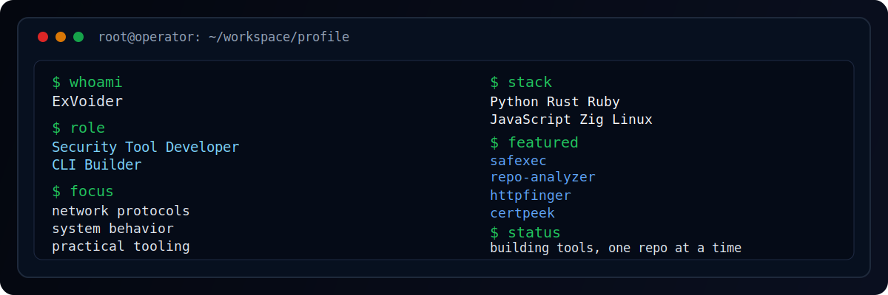

  

 

<h3 align="center">Security Tool Developer • CLI Builder • Networking Enthusiast</h3>

  I build small but practical tools around security, networking, system behavior, and command-line workflows.

---

## Featured Projects

  
  

  
  

---

## Stack

  
  
  
  
  
  

---

## GitHub Stats

  
  

  

---

## Current Focus

- security tooling
- network protocols
- CLI utilities
- system behavior
- sandboxing experiments

---

## Connect

  
  

